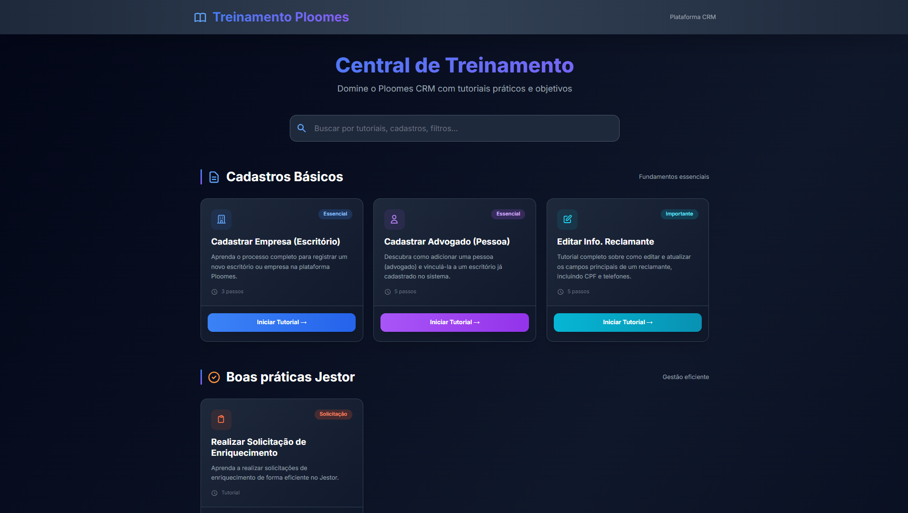
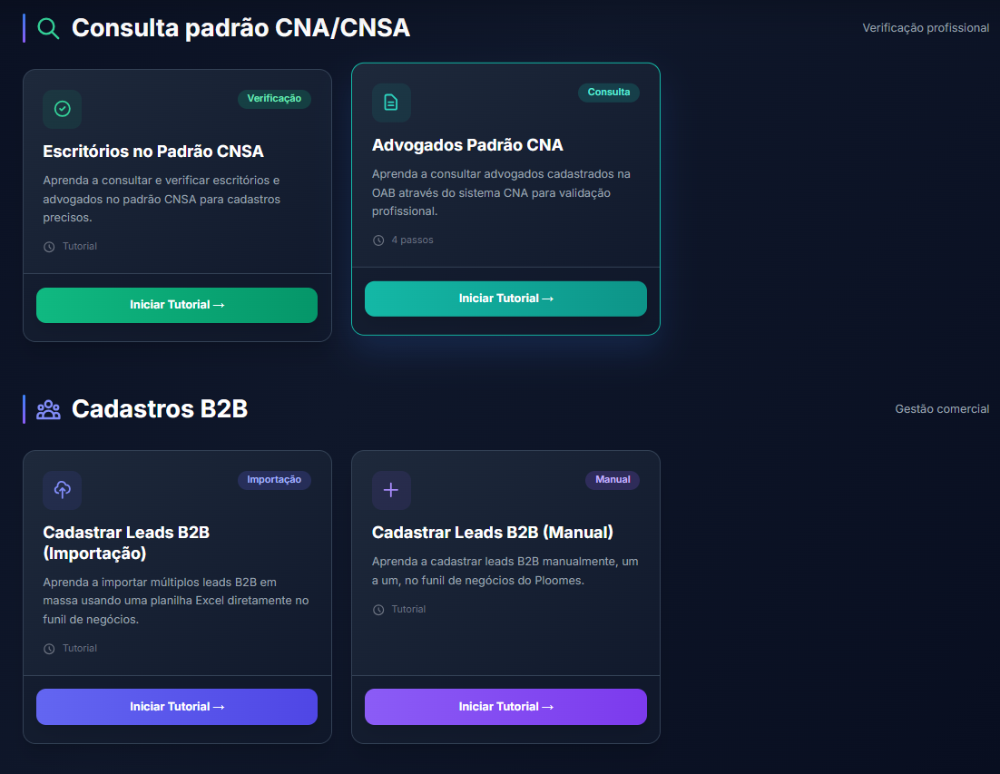

# Central de Treinamento Ploomes

## 📋 Descrição

Uma plataforma interativa de treinamento para o CRM Ploomes, desenvolvida para capacitar usuários em cadastros, consultas, filtros avançados e boas práticas de gestão. O site oferece tutoriais passo a passo com interface moderna e responsiva.

## ✨ Funcionalidades

- **Cadastros Básicos**: Tutoriais para cadastrar empresas, advogados e editar informações de reclamantes
- **Consulta Padrão CNA/CNSA**: Verificação profissional através dos sistemas da OAB
- **Cadastros B2B**: Importação e cadastro manual de leads empresariais
- **Recursos Avançados**: Criação de marcadores e filtros personalizados
- **Boas Práticas Jestor**: Solicitações eficientes no sistema Jestor
- **Interface Responsiva**: Compatível com desktop e dispositivos móveis
- **Navegação Intuitiva**: Painéis organizados por categoria com busca integrada

## 📸 Screenshots

### Painel Principal

*Visão geral do painel principal com todas as categorias de tutoriais disponíveis.*

*Barra de busca aprimorada para localizar tutoriais específicos.*

*Organização das categorias de treinamento com cards interativos.*

## 🌐 Demonstração Online

Acesse a versão online do projeto: [https://btblue-samuel.github.io/treinamento-ploomes/](https://btblue-samuel.github.io/treinamento-ploomes/)

## 📖 Como Usar

1. **Navegação**: Use a barra de busca no topo para encontrar tutoriais específicos
2. **Seleção de Tutorial**: Clique em qualquer card para acessar o tutorial correspondente
3. **Navegação no Tutorial**: Use os botões "Voltar" ou a navegação lateral para mover entre passos
4. **Recursos**: Baixe modelos de planilha quando disponíveis nos tutoriais

### Estrutura dos Tutoriais
- Cada tutorial é dividido em passos numerados
- Inclui imagens ilustrativas e dicas práticas
- Links para recursos externos quando necessário

## 📝 Licença

Este projeto está sob a licença MIT. Veja o arquivo `LICENSE` para mais detalhes.

## 📞 Suporte

Para dúvidas ou sugestões:
- Abra uma issue no GitHub
- Contate o administrador do sistema (sferreira@btcreditos.com)

---

**Desenvolvido para otimizar o uso do Ploomes CRM** 🚀</content>